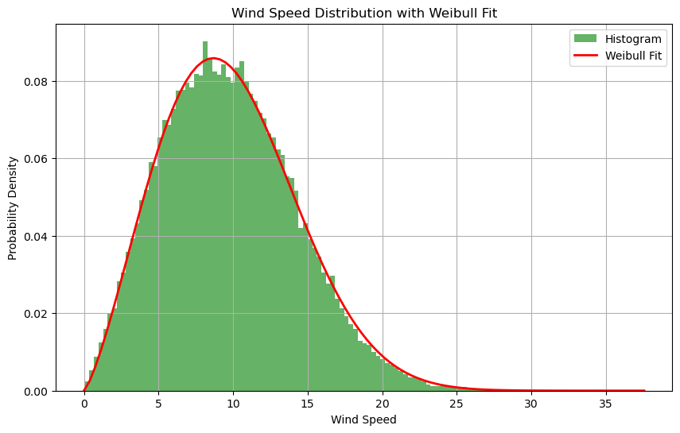

# Project03_46W38
A simple demonstration of Wind Resource and Energy Yield Assessment based on Reanalysis Data. You may also refer the short project report.



## Folder Structure
   ```
   Project03_46W38
   ├── inputs/
   │   └── resource files (.nc) and power curves (.csv)
   ├── src/
   │   └── WRA and EPE module
   ├── tests/
   │   └── TODO
   ├── examples/
   │   └── main.py (runs in evaluation)
   ├── .gitignore
   ├── LICENSE
   ├── README.md
   └── Project 03 Report.pdf
   ```

The `main.py` script inside the `examples` folder demonstrates, in a clear and structured manner, how the required functions are called and executed.

## Installation Instructions
* The ENV.yml contains the packages required. In bash run: $ conda env create -n ENVNAME --file ENV.yml.
* Run also: pip install windrose